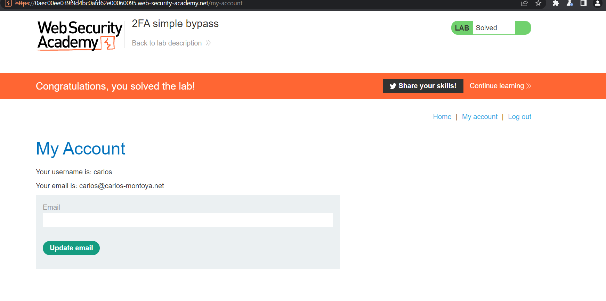
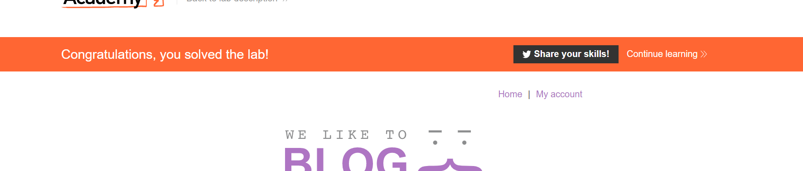
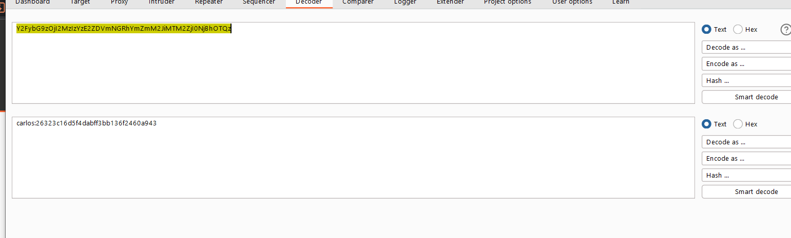
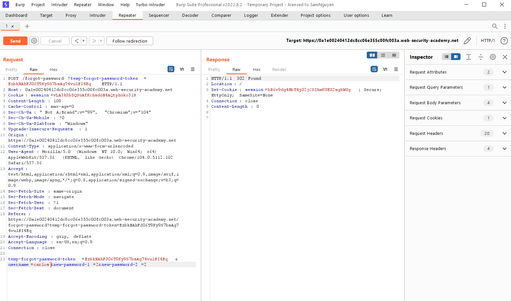

# Authentication vulnerabilities

> 

## What is authentication?

> Authentication là quá trình xác minh danh tính của một user. Có 3 yếu tố xác thực khác nhau:
>
> - Mật khẩu
> - Mã di động (Điện thoại)
> - Sinh trắc học, hành vi

---

## What is the difference between authentication and authorization?

> Authentication là quá trình xác minh user xem có phải đúng là user mà học tuyên bố hay không, trong khi authorization là việc xác minh xem user có được ủy quyền làm việc đó hay không.

---

## Cách phát sinh lỗ hổng:

> 2 Cách phát sinh:
>
> - Authen yếu -> dễ bị brute force
> - Logic vul hay mã hóa yếu

---

## Tác động

> Sau khi xâm nhập được vào hệ thống, attacker sẽ có toàn quyền truy cập vào dữ liệu, chức năng, xâm phạm account đó

---

## Phân loại

### Vulnerabilities in password-based login

#### Brute-force attacks

> Tấn công brute-force là khi kẻ tấn công sử dụng hệ thống thử và sai để cố gắng đoán thông tin đăng nhập hợp lệ của người dùng. Các cuộc tấn công này thường được tự động hóa bằng cách sử dụng danh sách từ gồm tên người dùng và mật khẩu. Tự động hóa quy trình này, đặc biệt là sử dụng các công cụ chuyên dụng, có khả năng cho phép kẻ tấn công thực hiện rất nhiều lần đăng nhập ở tốc độ cao.

> Brute-force không phải lúc nào cũng chỉ là một trường hợp phỏng đoán hoàn toàn ngẫu nhiên về tên người dùng và mật khẩu. Cũng bằng cách sử dụng logic cơ bản hoặc kiến ​​thức có sẵn công khai, những kẻ tấn công có thể tinh chỉnh các cuộc tấn công bạo lực để đưa ra các phỏng đoán có học thức hơn nhiều. Điều này làm tăng đáng kể hiệu quả của các cuộc tấn công như vậy. Các trang web dựa vào đăng nhập dựa trên mật khẩu làm phương pháp xác thực người dùng duy nhất của chúng có thể rất dễ bị tấn công nếu chúng không thực hiện đầy đủ biện pháp bảo vệ bạo lực.

---

##### Brute-forcing usernames

> Tên người dùng đặc biệt dễ đoán nếu chúng tuân theo một mẫu dễ nhận biết, chẳng hạn như địa chỉ email. Ví dụ: rất thường thấy các thông tin đăng nhập doanh nghiệp ở định dạng firstname.lastname@somecompany.com. Tuy nhiên, ngay cả khi không có khuôn mẫu rõ ràng, đôi khi ngay cả những tài khoản có đặc quyền cao cũng được tạo bằng cách sử dụng tên người dùng có thể dự đoán được, chẳng hạn như quản trị viên hoặc quản trị viên.

> Trong quá trình kiểm tra, hãy kiểm tra xem trang web có tiết lộ tên người dùng tiềm năng một cách công khai hay không. Ví dụ: bạn có thể truy cập hồ sơ người dùng mà không cần đăng nhập không? Ngay cả khi nội dung thực tế của hồ sơ bị ẩn, tên được sử dụng trong hồ sơ đôi khi giống với tên người dùng đăng nhập. Bạn cũng nên kiểm tra phản hồi HTTP để xem có địa chỉ email nào bị tiết lộ hay không. Đôi khi, phản hồi chứa địa chỉ email của những người dùng có đặc quyền cao như quản trị viên và bộ phận hỗ trợ CNTT.

---

##### Brute-forcing passwords

> Mật khẩu cũng có thể bị ép buộc một cách thô bạo, với độ khó thay đổi tùy theo độ mạnh của mật khẩu. Nhiều trang web áp dụng một số hình thức chính sách mật khẩu, buộc người dùng phải tạo mật khẩu có độ entropy cao, ít nhất về mặt lý thuyết, khó bị bẻ khóa chỉ bằng cách sử dụng brute-force. Điều này thường liên quan đến việc thực thi mật khẩu với:
>
> - Số lượng ký tự tối thiểu
> - Hỗ hợp chữ thường, chữ hoa
> - ít nhất một ký tự đặc biệt

> Tuy nhiên, trong khi mật khẩu có độ phức tạp cao rất khó để máy tính có thể bẻ khóa, chúng ta có thể sử dụng kiến ​​thức cơ bản về hành vi của con người để khai thác các lỗ hổng mà người dùng vô tình đưa vào hệ thống này. Thay vì tạo một mật khẩu mạnh với sự kết hợp ngẫu nhiên của các ký tự, người dùng thường lấy một mật khẩu mà họ có thể nhớ được và cố gắng làm cho nó phù hợp với chính sách mật khẩu. Ví dụ: nếu mật khẩu không được phép, người dùng có thể thử một cái gì đó như `Mypassword1!` hoặc `Myp4 $$ w0rd` thay thế.s

> Trong trường hợp chính sách yêu cầu người dùng thay đổi mật khẩu của họ thường xuyên, người dùng cũng thường chỉ thực hiện những thay đổi nhỏ, có thể dự đoán được đối với mật khẩu ưa thích của họ. Ví dụ, Mypassword1! trở thành Mypassword1? hoặc Mypassword2 !.

> Kiến thức về các thông tin xác thực có thể xảy ra và các mẫu có thể dự đoán được có nghĩa là các cuộc tấn công brute-force thường có thể phức tạp hơn nhiều và do đó hiệu quả hơn là chỉ lặp đi lặp lại mọi tổ hợp ký tự có thể có.

---

##### Username enumeration

> Liệt kê tên người dùng là khi kẻ tấn công có thể quan sát những thay đổi trong hành vi của trang web để xác định xem tên người dùng nhất định có hợp lệ hay không.

> Việc liệt kê tên người dùng thường xảy ra trên trang đăng nhập, ví dụ: khi bạn nhập tên người dùng hợp lệ nhưng mật khẩu không chính xác hoặc trên các biểu mẫu đăng ký khi bạn nhập tên người dùng đã được sử dụng. Điều này làm giảm đáng kể thời gian và nỗ lực cần thiết để bắt buộc đăng nhập vì kẻ tấn công có thể nhanh chóng tạo ra một danh sách rút gọn các tên người dùng hợp lệ.

> Trong khi cố gắng cưỡng bức trang đăng nhập, bạn nên đặc biệt chú ý đến bất kỳ sự khác biệt nào trong:
>
> - `Status code`: Trong một cuộc tấn công brute-force, mã trạng thái HTTP trả về có thể giống nhau đối với phần lớn các phỏng đoán vì hầu hết chúng đều sai. Nếu một phỏng đoán trả về một mã trạng thái khác, đây là một dấu hiệu mạnh mẽ cho thấy tên người dùng là chính xác. Cách tốt nhất là các trang web luôn trả về cùng một mã trạng thái bất kể kết quả như thế nào, nhưng thực tế này không phải lúc nào cũng được tuân thủ.
> - `Error messages`: Đôi khi thông báo lỗi trả về khác nhau tùy thuộc vào việc cả tên người dùng VÀ mật khẩu đều không chính xác hay chỉ có mật khẩu không chính xác. Cách tốt nhất là các trang web nên sử dụng các thông báo giống nhau, chung chung trong cả hai trường hợp, nhưng các lỗi đánh máy nhỏ đôi khi xuất hiện. Chỉ một ký tự không đúng vị trí sẽ khiến hai thông báo trở nên khác biệt, ngay cả trong trường hợp ký tự không hiển thị trên trang được hiển thị.
> - `Response time`: Nếu hầu hết các yêu cầu được xử lý với thời gian phản hồi tương tự, bất kỳ yêu cầu nào khác với điều này cho thấy có điều gì đó khác biệt đang xảy ra ở hậu trường. Đây là một dấu hiệu khác cho thấy tên người dùng được đoán có thể đúng. Ví dụ: một trang web chỉ có thể kiểm tra xem mật khẩu có đúng hay không nếu tên người dùng hợp lệ. Bước bổ sung này có thể làm tăng một chút thời gian phản hồi. Điều này có thể là tinh tế, nhưng kẻ tấn công có thể làm cho sự chậm trễ này rõ ràng hơn bằng cách nhập một mật khẩu quá dài mà trang web cần nhiều thời gian hơn để xử lý.

#### Lab: Username enumeration via different responses

> Des: Phòng thí nghiệm này dễ bị tấn công bởi kiểu liệt kê tên người dùng và mật khẩu. Nó có một tài khoản với tên người dùng và mật khẩu có thể dự đoán được, có thể tìm thấy trong danh sách từ sau:

> - [Candidate usernames](https://portswigger.net/web-security/authentication/auth-lab-usernames)
> - [Candidate passwords](https://portswigger.net/web-security/authentication/auth-lab-passwords)

> Để giải phòng thí nghiệm, hãy liệt kê một tên người dùng hợp lệ, brute-ép mật khẩu của người dùng này, sau đó truy cập trang tài khoản của họ.

> Bài này vào rồi đăng nhập bình thường, chặn và gửi request đăng nhập qua `intruder` và add payloads:
>  

> Sau khi paste passwd và user được cho trước sẽ attack và thấy được các response khác là `user invalid`, thấy riêng 1 response là `passwd invalid` với `length` khác:
> 

> Lấy nó và làm lại:
>    

---

#### Lab: Username enumeration via subtly different responses

> Des: Phòng thí nghiệm này rất dễ bị tấn công bởi các cuộc tấn công liệt kê tên người dùng và mật khẩu. Nó có một tài khoản với tên người dùng và mật khẩu có thể dự đoán được, có thể tìm thấy trong danh sách từ sau:

> - [Candidate usernames](https://portswigger.net/web-security/authentication/auth-lab-usernames)
> - [Candidate passwords](https://portswigger.net/web-security/authentication/auth-lab-passwords)

> Bài này là tìm sự khác nhau giữa `username` loggin đúng và sai nhờ `response` từ `request`:

> Vì nó ghi là mk or tk sai nên không thể truy xuất được user nào đúng để exploit
> 

> Lần này chỉ add payload vào username thôi:
> 
>
> Sau đó add thêm `Grep-Extract` để nó lọc các response với nhau:
> 
>
> Thấy sự khác nhau là không có dấu `.`:
> 

> Làm lại và add payload là passwd:
>  

---

#### Lab: Username enumeration via response timing

> Des: Phòng thí nghiệm này dễ bị liệt kê tên người dùng bằng cách sử dụng thời gian phản hồi của nó. Để giải phòng thí nghiệm, hãy liệt kê một tên người dùng hợp lệ, brute-ép mật khẩu của người dùng này, sau đó truy cập trang tài khoản của họ.

> Bài này khi login quá nhiều trên một ip sẽ bị block:
> 

> Gửi /login tới Intruder: 

> Set payload như hình, đặc biệt passwd phải dài tầm 100 kí tự hoặc hơn vì passwd càng dài thì thời gian xử lí sẽ càng lâu vì phải quét passwd (vì user đúng mà)
>
> Thêm payload là `X-Forwarded-For` là vì phải đổi ip (fake ip để không bị block 30'):  

> Chú ý cột time response càng lâu thì chính là nó: 

> Lấy được user rồi thì làm lại từ đầu nhưng đổi payload thành passwd:  

> và xong: 

---

### Flawed brute-force protection

> Bảo vệ trước cuộc attack brute force là làm cho nó phức tạp nhất để làm chậm và khó tự động hóa của kẻ attcker. 2 cách để chặn brute force là:
>
> - Khóa account mà người dùng đang login
> - Chặn IP

> Cả 2 cách đều cung cấp các mức độ bảo vệ khác nhau, nhưng không phải là bất khả xâm phạm

> Hoặc chỉ cần login trong khoảng thời gian đều đặn là sẽ bypass qua

---

#### Lab: Broken brute-force protection, IP block

> Des: Phòng thí nghiệm này dễ bị tấn công do lỗ hổng logic trong tính năng bảo vệ bằng mật khẩu. Để giải quyết phòng thí nghiệm, hãy ép mật khẩu của nạn nhân, sau đó đăng nhập và truy cập trang tài khoản của họ.

> Bài này login sai quá 3 lần là sẽ bị block ip trong 1': 

> Nhưng nếu nhập sai passwd đúng user thì sẽ báo là `Passwd invalid` nếu sai cả 2 thì sẽ báo là `username invalid`:  

> Giờ sẽ login 1 lần đúng, 1 lần sai để không bị chặn IP
>
> Tạo script để làm file so le giữ passwd đúng và sai và user đúng và sai:
>
> ```
> passwd = "peter"
>
> f = open("passwdold.txt", "r")
> d = open("passwdnew.txt", "w+")
>
> for i in f:
>    d.write(f"{i}")
>    d.write(f"{passwd}\n")
>
> f.close()
> d.close()
> ```

> ```
> name1 = "carlos"
> name2 = "wiener"
> length = 0
>
> f = open("username.txt", "w+")
>
> while length <= 100:
>    f.write(f"{name1}\n")
>    f.write(f"{name2}\n")
>    length = length + 1
>
> f.close()
> ```

> Sau đó tại intruder rồi config:
>   

> Vì cần request vào từng lần nên để 1 lần:
>   

---

### Account locking

> Một cách mà web cố gắng ngăn chặn brute force là block tài khoản khi một số lần đăng nhập không thành công

#### Lab: Username enumeration via account lock

> Des: Phòng thí nghiệm này dễ bị liệt kê tên người dùng. Nó sử dụng khóa tài khoản, nhưng điều này chứa một lỗ hổng logic. Để giải phòng thí nghiệm, hãy liệt kê một tên người dùng hợp lệ, brute-ép mật khẩu của người dùng này, sau đó truy cập trang tài khoản của họ.

> Nếu login vào 1 tài khoản sẽ bị lock: 

> Send nó qua intruder: 

> Và set payload như hình: 

> Tại payload 2 để `Generate=5` để mỗi account đc 5 lần request: 

> Tìm account có tim response lâu nhất và check response: 
>
> Các account còn lại đều bị lock

> Lấy account đó và set lại cộng list passwd:     

---

#### User rate limiting

> Một cách khác mà các trang web cố gắng chặn tấn công brute force là thông qua `user rate limit`. Nếu có quá nhiều yêu cầu login trên một ip thì sẽ khiến ip bị chặn

#### Lab: Broken brute-force protection, multiple credentials per request

> Des: Phòng thí nghiệm này dễ bị tấn công do có một lỗ hổng logic trong tính năng bảo vệ bạo lực của nó. Để giải quyết phòng thí nghiệm, hãy ép buộc mật khẩu của Carlos, sau đó truy cập vào trang tài khoản của anh ấy.

> Vì request là chuỗi json nên sẽ làm list passwd như sau:   

> file passwd + user: https://gist.github.com/saamnguyen/1f63d5aa9c771021bb6a4573c24489e9

---

### HTTP basic authentication

> Client sẽ nhận được authentication token từ server, code này được ghép từ tên của user và passwd và encode từ Base64. Nó sẽ được lưu trên trình duyệt và sẽ được tự động thêm vào `Authorizaton` header
>
> ```
> Authorization: Basic base64(username:password)
> ```

> Đây sẽ không phải là authetication method an toàn, vì nó liên quan tới info login của user và có thể bị chặn bắt

---

### Vulnerabilities in multi-factor authentication

> Nhiều trang web sử dụng passwd để xác thực user. Tuy nhiên nhiều user chứng minh danh tính bằng nhiều yếu tố khác nhau

> Việc xác minh bằng sinh trắc học là điều không thể với các trang web. Ngày nay người ta thấy xác thực 2 yếu tố là bắt buộc hoặc tùy chọn (2FA) . Ví dụ như gửi code về máy vật lý đang sở hữu

#### Two-factor authentication tokens

> User thường được xác minh từ một thiết bị vật lý nào đó, ví dụ như Google Authenticator

> Tuy nhiên các code này không phải là do chính thiết bị tạo ra, nó có thể bị chặn bắt hoặc đổi sim....

#### Bypassing two-factor authentication

> Đôi khi việc triển khai two-factor authentication có thể bị thiếu sót đến mức có thể bỏ qua hoàn toàn

> Nếu lần đầu tiên người dùng được nhắc nhập mật khẩu, sau đó nhắc nhập mã xác minh ở một trang riêng biệt. Trong trường hợp này nên nghiên cứu thử xem có thể redirect thẳng sang các trang `logged-in only`. Đôi khi web sẽ không thực sự kiểm tra xem có hoàn thành các bước sau hay không.

##### Lab: 2FA simple bypass

> Xác thực hai yếu tố của phòng thí nghiệm này có thể bị bỏ qua. Bạn đã có được tên người dùng và mật khẩu hợp lệ, nhưng không có quyền truy cập vào mã xác minh 2FA của người dùng. Để giải quyết phòng thí nghiệm, hãy truy cập trang tài khoản của Carlos.

> wiener:peter, victim: carlos:montoya

> Bài này chỉ cần login tài khoản của usr victim và khi web bắt nhập code thì redirect sang path `my-account` là solve 

> Vì khi scan path thì thấy path này: 

---

#### Flawed two-factor verification logic

> Đôi khi logic sai sót trong quá trình xác thực 2FA là khi user login thành công, trang web không xác minh đầy đủ rằng một người dùng đang hoàn thành step thứ 2

> Ví dụ: người dùng đăng nhập bằng thông tin đăng nhập bình thường của họ trong bước đầu tiên như sau:
>
> ```
> POST /login-steps/first HTTP/1.1
> Host: vulnerable-website.com
> ...
> username=carlos&password=qwerty
> ```

> Sau đó, họ được gán một cookie có liên quan đến tài khoản của họ, trước khi được chuyển sang bước thứ hai của quá trình đăng nhập:
>
> ```
> HTTP/1.1 200 OK
> Set-Cookie: account=carlos
>
> GET /login-steps/second HTTP/1.1
> Cookie: account=carlos
> ```

> Khi gửi mã xác minh, yêu cầu sử dụng cookie này để xác định tài khoản mà người dùng đang cố gắng truy cập:
>
> ```
> POST /login-steps/second HTTP/1.1
> Host: vulnerable-website.com
> Cookie: account=carlos
> ...
> verification-code=123456
> ```

> Trong trường hợp này, kẻ tấn công có thể đăng nhập bằng thông tin đăng nhập của chính họ nhưng sau đó thay đổi giá trị của cookie tài khoản thành bất kỳ tên người dùng tùy ý nào khi gửi mã xác minh.
>
> ```
> POST /login-steps/second HTTP/1.1
> Host: vulnerable-website.com
> Cookie: account=victim-user
> ...
> verification-code=123456
> ```

> Điều này cực kỳ nguy hiểm nếu sau đó kẻ tấn công có thể cưỡng bức mã xác minh vì nó sẽ cho phép họ đăng nhập vào tài khoản của người dùng tùy ý dựa hoàn toàn vào tên người dùng của họ. Họ thậm chí sẽ không bao giờ cần biết mật khẩu của người dùng

##### Lab: 2FA broken logic

> Xác thực hai yếu tố của phòng thí nghiệm này dễ bị tấn công do logic sai sót của nó. Để giải quyết phòng thí nghiệm, hãy truy cập trang tài khoản của Carlos.

> wiener:peter

> Bài này login tài khoản đã được cho vào để lấy mã, qua `Email client` để xem code gửi về:
> 

> Tìm path `/login2` để thay đổi `verify=carlos` để lấy mã: 

> Gửi sang intruder và đổi payload và sang attack brute force:  

> Tìm `Status code=302`:  

---

#### Brute-forcing 2FA verification codes

> Giống như passwd thì các trang web sẽ cố gắng ngăn chặn việc attacker có thể brute force mã xác minh 2FA, vì thườn thì mã này sẽ có độ tài từ 4-6 kí tự. Nếu không có cách protect thì sẽ bị bẻ dễ dàng

> Một số trang web sẽ tự động logout nếu user nhập một số mã incorrect . Điều này không ăn thua vì attacker có thể tự động hóa quy trình bằng cách sử dụng macro trong intruder

##### Lab: 2FA bypass using a brute-force attack

> Xác thực hai yếu tố của phòng thí nghiệm này dễ bị ép buộc. Bạn đã có được tên người dùng và mật khẩu hợp lệ, nhưng không có quyền truy cập vào mã xác minh 2FA của người dùng. Để giải quyết phòng thí nghiệm, hãy bắt buộc mã 2FA và truy cập trang tài khoản của Carlos.

> Victim's credentials: carlos:montoya

> Bài này khi nhập mã lần thứ 2 nếu sai sẽ tự động logout ra: 

> Nên sẽ sử dụng macro để tự động hóa chương trình:
>
> - Giờ phải login vào path `GET /login/` 
> - Sau đó phải gửi username, password là path `POST /login` 
> - Rồi phải redirect sang path `GET /login2` để nhập code: 

> Tạo macro để tự động hóa: 

> Select all: 

> Add role actions:  

> edit: 

> Sau đó send cái path để gửi code sang intruder để dùng, nó sẽ tự thêm cái macro vào: 

> add payload là `mfa-code`:  

> Cho luồng là 1 lần thôi, nếu nhiều quá thì sẽ bị detect  

---

### Vulnerabilities in other authentication mechanisms

> Ngoài các chức năng cơ bản là login, ngoài ra các trang web thường cho user quản lí tài khoản của họ như cho phép đổi passwd. Cơ chế này cũng có thể có các vul để hacker có thể khai thác

#### Keeping users logged in

> Một tính năng phổ biến là duy trì login, sẽ có nút như `Remember me`

> Tính năng này thường được triển khai với một loại token là `remember me`, sau đó sẽ được lưu trữ trong 1 cookie liên tục. Sở hữu loại cookie này thì có thể bỏ qua toàn bộ quy trình login. Một số trang web tạo cookie này bằng cách ghép nối, chẳng hạn như username + time create.

> Hoặc hacker có thể tự tạo ra tài khoản rồi nghiên cứu cách tạo ra cookie đó...

##### Lab: Brute-forcing a stay-logged-in cookie

> Des: Lab này cho phép user login khi đã close browser. Cookie cũng dễ bị brute force

> Để solve thì login vào tài khoản carlos và vào `my-account`

> Your credentials: wiener:peter

> Login với tài khoản đã được cho: 

> Chặn bắt bẳng burp suite thấy: 

> Cookie đã được set và encode ta đc username + mã hash md5: 

> Để brute force được thì phải có đc cookie login on. Giờ đã biết được cách tạo cookie rồi thì ta lấy cookie của victim tôi: 

> Send path `/my-account` sang intruder : 

> Add payload: 

> Thêm payload processing:   

> Vì test nên sẽ cho passwd thật của tài khoản được cho: 

> Vì là cookie đúng nên nó sẽ có đoạn là `Update email`: 

> Nên khi attack lại thì thêm Grep-Match là update email để biết là attack thành công 

> Attack lại: 

> Sửa add prefix là carlos:    

---

> Ngay cả khi attacker không thể tạo account riêng của họ thì vẫn có thể khai thác. Ví dụ như dùng XSS để đánh cắp cookie

> Trong một số trường hợp hiếm hoi, có thể lấy được mật khẩu bản rõ từ cookie

##### Lab: Offline password cracking

> Des: Lab này lưu trữ mật khẩu hash của user từ cookie. Lab cũng chưa vul XSS trong chức năng bình luận. Để solve thì lấy cookie đã đăng nhập của carlos và crack passwd của carlos, sau đó login và xóa tài khoản

> Your credentials: wiener:peter

> Bài này bị dính XSS tại comment: 

> Chèn script vào commit rồi gửi cookie qua server :   

---

### Resetting user passwords

> Trong thực tế, một số người dùng thường sẽ quên mật khẩu, nên sẽ phải reset mật khẩu

#### Sending passwords by email

> Các trang web thường sẽ tạo mật khẩu mới và sẽ gửi cho user thông qua email. Thường sẽ hết hạn trong một khoảng thời gian ngắn

---

#### Resetting passwords using a URL

> Một phương pháp reset passwd an toàn hơn là gửi cho user URL duy nhất và đưa tới trang change passwd
>
> ```
> http://vulnerable-website.com/reset-password?user=victim-user
> ```

> Ví dụ trên thì nó có thể thay đổi user thành 1 user khác, cách triển khai tốt hơn là tạo token
>
> ```
> http://vulnerable-website.com/reset-password?token=a0ba0d1cb3b63d13822572fcff1a241895d893f659164d4cc550b421ebdd48a8
> ```

> Khi user truy cập vào url thì backend sẽ kiểm tra xem token có tồn tại hay còn hiệu lực hay không, và sẽ bị hủy ngay khi passwd đã được đặt lại

> Tuy nhiên, một số trang web cũng không thể xác thực lại mã thông báo khi biểu mẫu đặt lại được gửi. Trong trường hợp này, kẻ tấn công có thể chỉ cần truy cập biểu mẫu đặt lại từ tài khoản của chính họ, xóa mã thông báo và tận dụng trang này để đặt lại mật khẩu của người dùng tùy ý.

##### Lab: Password reset broken logic

> Des: Chức năng đặt lại mật khẩu của phòng thí nghiệm này dễ bị tấn công. Để giải quyết phòng thí nghiệm, hãy đặt lại mật khẩu của Carlos, sau đó đăng nhập và truy cập trang "Tài khoản của tôi" của anh ấy.

> Your credentials: wiener:peter

> Bài này chỉ cần vào forgot passwd để thay đổi passwd của user `wiener`. Vì token của `wiener` không hết hạn và chỉ cần thay tên username thành `carlos` là đổi được:  

---

> Nếu URL trong email được đặt lại tự động, thì URL này cũng có thể bị nhiễm vul đặt lại passwd. Trong case này, attacker có thể ăn cắp token của user another và sử dụng để thay đổi passwd của nó.

##### Lab: Password reset poisoning via middleware

> Des: Lab này dễ bị dính vul đặt lại passwd. Carlos bất cẩn nhấp vào bất kì liên kết nào trong email nhận được. Login vào tài khoản `wiener` , mọi mail được gửi đến tài khoản này đều có thể được đọc qua ứng dụng mail ở server khác:

> Bài này mỗi lần đặt mật khẩu khác thì sẽ hết hạn token, nên không thể sử dụng lại nữa: 

> Sử dụng luôn server mà Lab cung cấp, thêm tại request header: `X-Forwarded-Host: server` để nó gửi token về server:    
